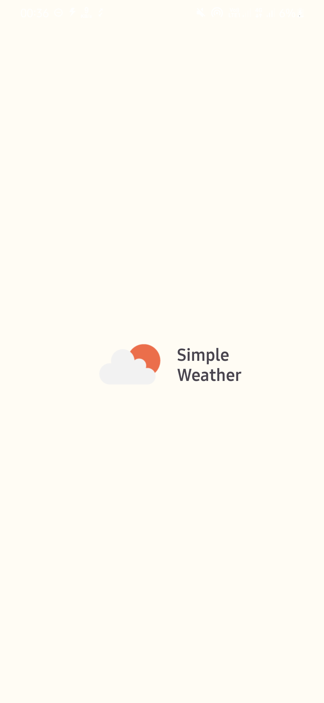
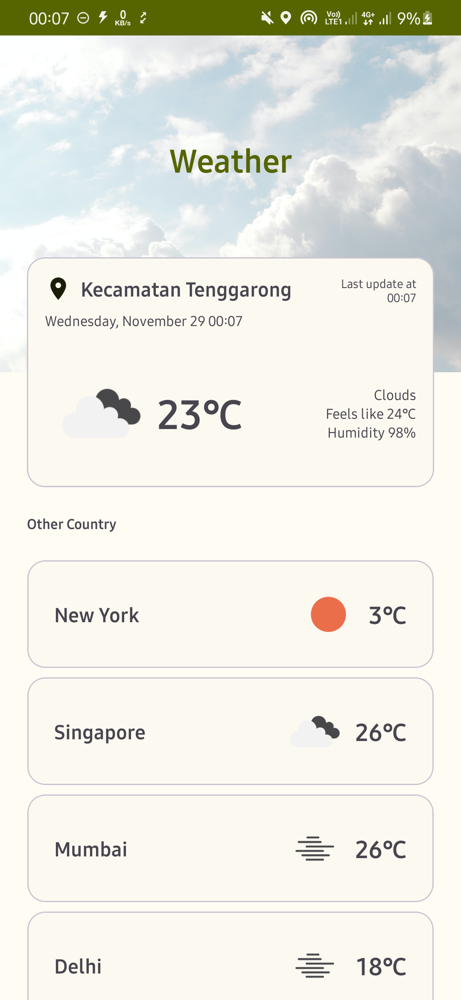

# Simple Weather

a simple app to check current weather in current location.

## Architecture
This project was created by implementing MVVM (Model-View-ViewModel) and [Clean Architecture](https://blog.cleancoder.com/uncle-bob/2012/08/13/the-clean-architecture.html).

## Libraries
Libraries used
- API Client [Retrofit](https://square.github.io/retrofit/)
- Local Storage [Room Database](https://developer.android.com/jetpack/androidx/releases/room)
- Dependency Injection [Dagger Hilt](https://dagger.dev/hilt/)
- Logging Interceptor [Chucker Interceptor](https://github.com/ChuckerTeam/chucker)
- Image Loader [Coil](https://coil-kt.github.io/coil/)

## Public API
This project uses the public API [OpenWeather](https://openweathermap.org/api)

## Screenshots

 
